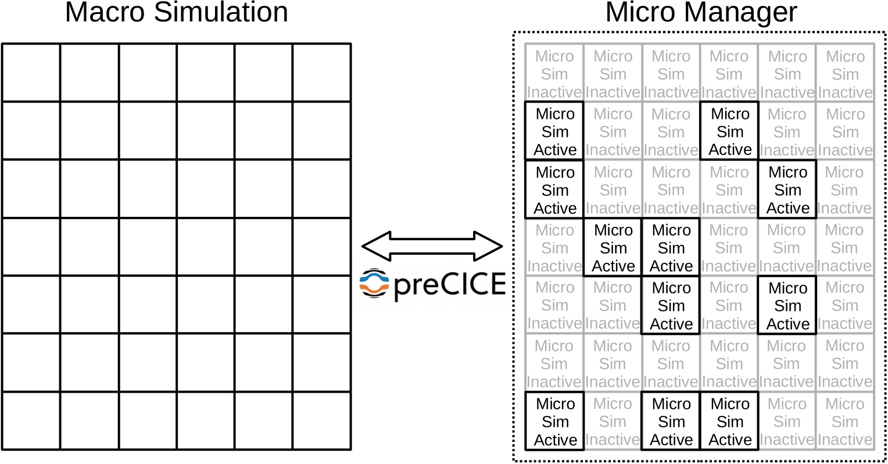

## What is this?

The Micro Manager manages many simulations on a micro scale and couples them to one simulation on a macro scale. For the coupling itself, it heavily relies on the coupling library [preCICE](https://precice.org/index.html).

The Micro Manager can also compute snapshots of micro simulations given macro input parameters in an offline manner without preCICE.

## What can it do?

The Micro Manager couples many micro simulations with one macro simulation. This includes ...

- ... transferring scalar and vector data to and from a large number of micro simulations.
- ... running micro simulations in parallel using MPI.
- ... adaptively activating and deactivating micro simulations based on a similarity calculation.

## Documentation

To use the Micro Manager for a macro-micro coupling, your micro simulation code needs to be in a library format with a specific class name and functions with specific names. For a macro-micro coupled problem, the macro simulation code is coupled to preCICE directly. The section [couple your code](couple-your-code-overview.html) of the preCICE documentation gives more details on coupling existing codes. To set up a macro-micro coupled simulation using the Micro Manager, follow these steps:

- [Installation](tooling-micro-manager-installation.html)
- [Preparing micro simulation](tooling-micro-manager-prepare-micro-simulation.html)
- [Configuration](tooling-micro-manager-configuration.html)
- [Running](tooling-micro-manager-running.html)

To compute snapshots in an offline manner your simulation code also needs to be in a library format with a specific class name and functions with specific names. To set up a snapshot computation using the Micro Manager, follow these steps:

- [Snapshot computation](tooling-micro-manager-snapshot-configuration.html)
